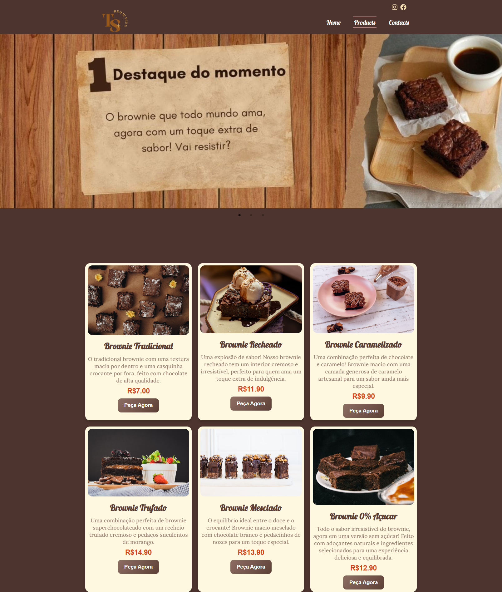

# Loja de Brownie (EM DESENVOLVIMENTO)

## Ts Brownie & cia




### Objetivo.
 - O objetivo desse projeto consiste em desenvolver uma loja virtual especializada na venda de brownies, onde os clientes poderão explorar um catálogo de produtos e personalizar suas compras, escolhendo entre diferentes opções de brownies e acompanhamentos disponíveis. A plataforma visa proporcionar uma experiência de compra simples e intuitiva, com foco em conveniência e personalização.


### Principais soluções com esse projeto.
 - Resolver a dificuldade e falta de plataforma online, flúida e acessível para quem deseja comprar brownies de qualidade.

## Funcionalidades Principais

- **Página Inicial**: Exibição dos produtos, promoções e novidades.
- **Cadastro de Usuários**: Permitir que os clientes se cadastrem com e-mail, ou façam login via redes sociais.
- **Catálogo de Produtos**: Lista de brownies com opções de personalização (sabores, tamanhos, embalagens).
- **Carrinho de Compras**: Adicionar, editar e remover itens.
- **Finalização de Pedido**: Escolha de métodos de pagamento e informações de entrega.
- **Sistema de Pagamento**: Integração com Stripe ou PayPal.
- **Acompanhamento de Pedidos**: Sistema de rastreamento para o cliente ver o status do pedido.
- **Área Administrativa**: Controle de pedidos, produtos, estoque e relatórios financeiros.

## Público-Alvo

- **Clientes**: Pessoas de todas as idades que apreciam brownies e buscam conveniência na compra online.
- **Administração**: Donos da loja que precisam de um sistema simples para gerenciar pedidos e vendas.


## Tecnologias
- **Frontend**: React, CSS, Bootstrap
- **Backend**: Node.js, Express, JWT
- **Banco de Dados**: MongoDB
- **Sistema de Pagamento**: Stripe ou PayPal


---

## Instruções de Execução
1. Clone o repositório.
2. Instale as dependências com:
   ```bash
   npm install
## Próximos Passos
- Implementar a autenticação de usuários.
- Desenvolver o sistema de pagamento.
- Criar a área administrativa.
- Realizar testes de integração e usabilidade.


### Estrutura de Pastas
```markdown

- FrontEnd
- /src
  - /components  # Componentes React
  - /pages  # Páginas React ( React router dom )
  - /public  # Arquivos públicos
  - /styles  # Arquivos de estilo

  - /backend  # Backend Node.js
  /src
  - /controllers  # Componentes React
  - /routes  ->
  - /services  # Servicos
```
